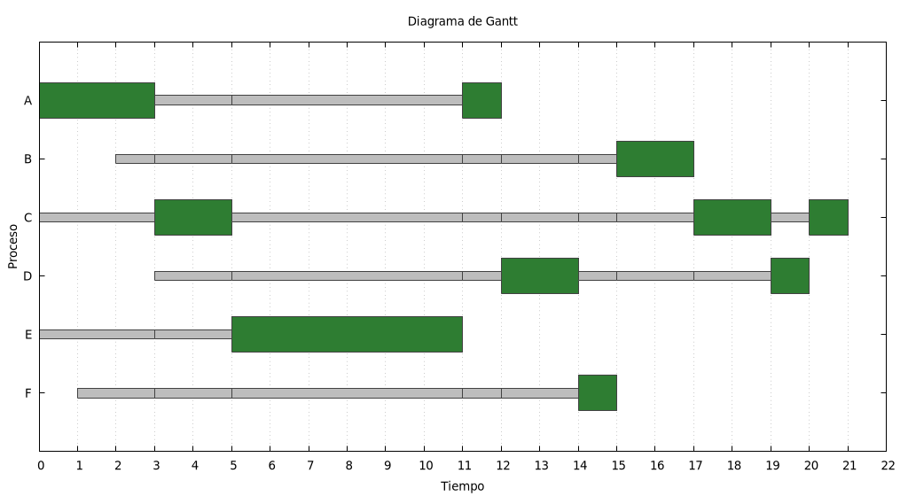
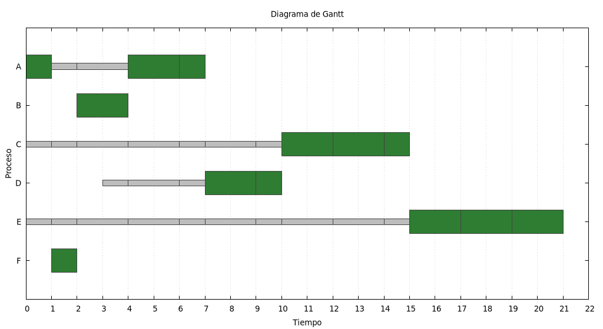

# Bitácora — Proyecto de primer corte: planificación de procesos

**Autores:** Edward Esteban Davila Salazar, Miguel Angel Perez Mera

**Entorno de verificación:** Debian 13 (trixie), `g++` (C++17), `gnuplot`,
máquina virtual de VirtualBox del laboratorio de la materia.

## Comprobación de resultados

Sobre el conjunto de procesos del taller de la sesión 6 (P1 ráfaga 7
desde 0, P2 ráfaga 4 desde 2, P3 ráfaga 1 desde 4, P4 ráfaga 4 desde
5), los cuatro algoritmos reproducen exactamente las cifras conocidas:

| Algoritmo | Esperado | Obtenido |
| --- | --- | --- |
| FIFO | 4.750 | 4.750 |
| SJF | 4.000 | 4.000 |
| RR (quantum 2) | 5.000 | 5.000 |
| SRT (quantum 2) | 3.000 | 3.000 |

```bash
make
./planificador test/taller_fifo.txt
./planificador test/taller_sjf.txt
./planificador test/taller_rr.txt
./planificador test/taller_srt.txt
```

Además del promedio, se revisó la **secuencia de ejecución** de cada
uno (no solo el número final), porque dos planificaciones distintas
pueden coincidir en el promedio:

- FIFO: `P1(7) P2(4) P3(1) P4(4)` — un bloque continuo por proceso, en
  orden de llegada.
- SJF: `P1(7) P3(1) P2(4) P4(4)` — P3 (ráfaga 1) pasa antes que P2
  (ráfaga 4), aunque P2 llegó primero.
- RR: `P1(2) P2(2) P1(2) P3(1) P2(2) P4(2) P1(2) P4(2) P1(1)` — los
  cuatro se turnan la CPU en fragmentos de a lo sumo 2 unidades.
- SRT: `P1(2) P2(2) P3(1) P2(2) P4(2) P4(2) P1(2) P1(2) P1(1)` — P3
  expropia a P2 apenas llega, porque su ráfaga (1) es menor que el
  tiempo que le resta a P2 en ese instante.

En los diagramas de Gantt de `test/taller_*.png` se confirmó además
que, al tratarse de una sola CPU, en ningún instante hay dos procesos
con su barra de ejecución (verde) superpuesta.

## Qué línea de código distingue a cada algoritmo, y por qué

Los cuatro algoritmos comparten exactamente el mismo bucle de
simulación en `planificar()`; lo único que cambia entre ellos son las
decisiones en dos puntos del código: **por dónde entra un proceso a la
cola de listos** (al llegar, y al ser interrumpido sin terminar) y **si
se expropia o no**. Por eso, antes de resolver los `\todo`, los cuatro
algoritmos daban el mismo resultado que FIFO: compartían el mismo
mecanismo y solo diferían en el nombre.

- **FIFO** (ya resuelto, sirve de referencia). Los procesos entran a
  `listos` en orden de llegada (`c.listos.push_back(p)` en
  `procesar_llegadas`), y un proceso que no termina su quantum vuelve
  al **frente** de la cola (`cola.listos.push_front(actual)`), de modo
  que retoma la CPU antes que cualquier otro — así se simula la
  ausencia de expropiación, aunque el bucle avance en unidades de
  quantum.

- **SJF**. La diferencia está en `procesar_llegadas`: en vez de
  `push_back`, un proceso que llega a una cola SJF se inserta con
  `insertar_por_restante()`, que lo ubica según su ráfaga entre los
  procesos que ya esperaban. Esa es la única línea que distingue a SJF
  de FIFO: decide **quién es el siguiente** cuando la CPU se libera. La
  rama que reencola a un proceso interrumpido se dejó **igual que en
  FIFO a propósito** (`push_front`): SJF tampoco expropia, así que un
  proceso que ya tiene la CPU debe conservarla hasta terminar sin
  importar qué tan corta sea la ráfaga de quien acaba de llegar, y
  `push_front` logra justo eso (vuelve a ser el primero en la próxima
  vuelta del bucle).

- **RR**. La diferencia está en la rama que reencola a un proceso que
  agotó su quantum sin terminar: `cola.listos.push_back(actual)` en vez
  de `push_front`. Ese único cambio —ir al **final** en lugar de al
  frente— es lo que le da su vuelta rotativa: el proceso cede su lugar
  a quien ya estaba esperando, en vez de recuperar la CPU de inmediato.

- **SRT**. Combina las dos ideas anteriores más la expropiación en
  caliente. Comparte con SJF el `insertar_por_restante()` en
  `procesar_llegadas` (también ordena por ráfaga a quien llega), pero
  además reencola por `insertar_por_restante()` —no por `push_front`—
  al proceso que no terminó su turno, porque en SRT sí debe volver a
  competir por la CPU con su tiempo restante actualizado. Y antes de
  ejecutar cada quantum, un bloque agregado en `planificar()` recorre
  las llegadas pendientes de esa cola y, si alguna tiene una ráfaga
  menor que el tiempo que le quedaría al proceso actual **en el
  instante en que llega**, recorta el quantum asignado a ese instante
  y no rota a la siguiente cola (`cambiar_de_cola = false`), para que
  el proceso recién llegado compita de inmediato. Esta rama se
  verificó por separado con un caso sintético (un proceso de ráfaga 10
  y otro de ráfaga 1 llegando en t=1, con quantum 5): sin este bloque
  el proceso largo habría conservado la CPU 5 unidades más; con él, se
  corta exactamente en t=1.

### Sobre el desempate

`insertar_por_restante()` avanza mientras el elemento ya presente en la
cola tenga un restante **menor o igual** al del que se inserta (`<=`, no
`<`); eso dejó a los procesos ya presentes por delante de cualquier
recién llegado con el mismo restante, así que el desempate lo sigue
decidiendo el orden en que ya estaban, y ese orden a su vez viene de
haber sido insertados en orden de llegada la primera vez.

## Punto 5 — un caso propio con tres colas de prioridad

### El caso

Se construyó un caso con 6 procesos repartidos en 3 colas de
prioridad, cada una con un algoritmo distinto (`test/caso_propio.txt`):

| Cola | Algoritmo | Quantum | Procesos (llegada, ráfaga) |
| --- | --- | --- | --- |
| 1 (mayor prioridad) | SRT | 3 | A (0, 4), B (2, 2) |
| 2 | RR | 2 | C (0, 5), D (3, 3) |
| 3 (menor prioridad) | FIFO | 10 | E (0, 6), F (1, 1) |

La cola 3 se armó a propósito para exponer un caso extremo: **F**
(ráfaga 1, casi instantáneo) llega en t=1, justo un instante después de
**E** (ráfaga 6, el proceso más largo de todo el caso), y ambos caen en
la **misma** cola FIFO. Como FIFO no reordena por ráfaga, F queda
atrapado detrás de E sin ningún mecanismo que lo rescate.

```bash
./planificador -t test/caso_propio.txt
```

```
Colas de prioridad: 3
  Cola 1: SRT, quantum 3
  Cola 2: RR, quantum 2
  Cola 3: FIFO, quantum 10

    #  Proceso  Prior.  Lleg.  Rafaga  Espera  Fin
    1        A       1      0       4       8   12
    2        B       1      2       2      13   17
    3        C       2      0       5      16   21
    4        D       2      3       3      14   20
    5        E       3      0       6       5   11
    6        F       3      1       1      13   15

Tiempo promedio de espera: 11.500
Secuencia: A(3) C(2) E(6) A(1) D(2) F(1) B(2) C(2) D(1) C(1)
```



F espera **13** unidades de tiempo para recibir apenas 1 unidad de
CPU: 13 veces su propia ráfaga. Es, con claridad, el peor caso del
grupo en términos relativos, aunque su espera absoluta (13) no sea la
más alta en números crudos (C espera 16, D espera 14) — la comparación
justa es contra lo que cada proceso *necesitaba*, no contra un número
aislado.

### La comparación: los mismos 6 procesos en una sola cola

Para explicar **por qué** el reparto en colas produce un resultado
distinto, se armó el mismo conjunto de 6 procesos pero sin dividir en
colas, todos en una única cola SRT (`test/caso_propio_una_cola.txt`):

```bash
./planificador test/caso_propio_una_cola.txt
```

```
Colas de prioridad: 1
  Cola 1: SRT, quantum 2

    #  Proceso  Prior.  Lleg.  Rafaga  Espera  Fin
    1        A       1      0       4       3    7
    2        B       1      2       2       0    4
    3        C       1      0       5      10   15
    4        D       1      3       3       4   10
    5        E       1      0       6      15   21
    6        F       1      1       1       0    2

Tiempo promedio de espera: 5.333
Secuencia: A(1) F(1) B(2) A(2) A(1) D(2) D(1) C(2) C(2) C(1) E(2) E(2) E(2)
```



La diferencia es contundente:

| | 3 colas (caso propio) | 1 sola cola SRT |
| --- | --- | --- |
| Espera de F | **13** | **0** |
| Espera promedio general | **11.500** | **5.333** |

### Por qué cambia el resultado

El simulador recorre las colas de forma **circular**, dando un turno a
cada una que tenga procesos listos — no es que una cola de menor
prioridad quede completamente bloqueada mientras las de arriba tengan
algo pendiente, pero sí queda **encerrada dentro de su propio
algoritmo**: una vez que un proceso entra a una cola, solo compite por
el turno de esa cola con los demás procesos de esa misma cola, según
el algoritmo que a esa cola le corresponda. F fue asignado a la cola 3
(FIFO), y dentro de esa cola compite únicamente contra E — no contra A,
B, C ni D—, y FIFO no tiene ningún mecanismo para notar que la ráfaga
de F es mucho menor que la de E. El resultado es que F debe esperar a
que E termine su turno completo (FIFO no expropia), sin importar cuán
injusto sea eso en términos globales.

En una sola cola con SRT, en cambio, **todos** los procesos compiten
entre sí por el mismo criterio (menor tiempo restante), sin importar
en qué "grupo" habrían caído. Apenas F llega en t=1 con una ráfaga de
apenas 1, SRT lo prioriza de inmediato sobre cualquier otro proceso en
curso —incluido A, que ya estaba corriendo—, y F recibe la CPU casi
sin esperar.

Repartir procesos en colas de prioridad, entonces, no es equivalente a
resolver el mismo conjunto con el "mejor" algoritmo disponible: cada
cola optimiza únicamente **puertas adentro**, con sus propios
procesos, y la calidad del algoritmo elegido para la cola de un
proceso importa tanto o más que su propia ráfaga. Es exactamente el
mismo fenómeno que describe la teoría sobre planificación multinivel:
un proceso corto puede quedar mal servido si el diseño no permite que
"emigre" hacia una cola donde compita en igualdad de condiciones — algo
que este simulador, deliberadamente, no implementa (cada proceso queda
fijo en la cola a la que fue asignado desde el principio).
