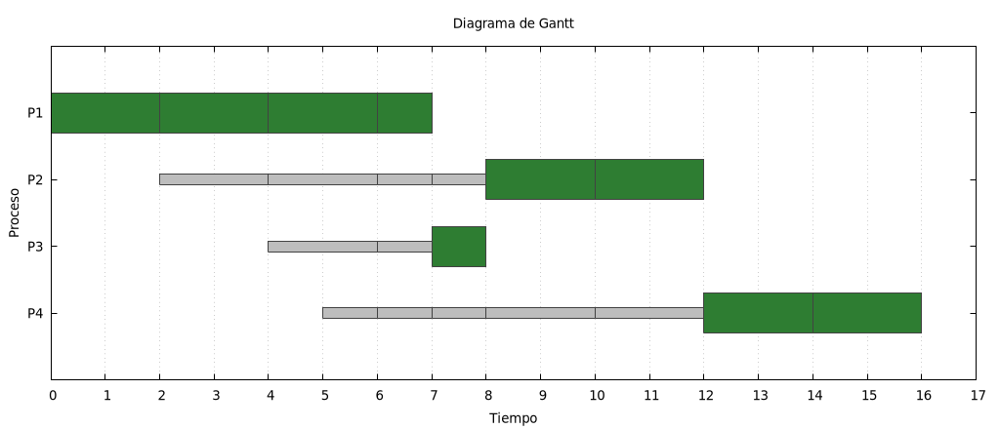
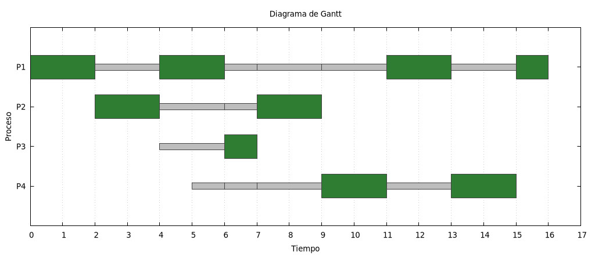
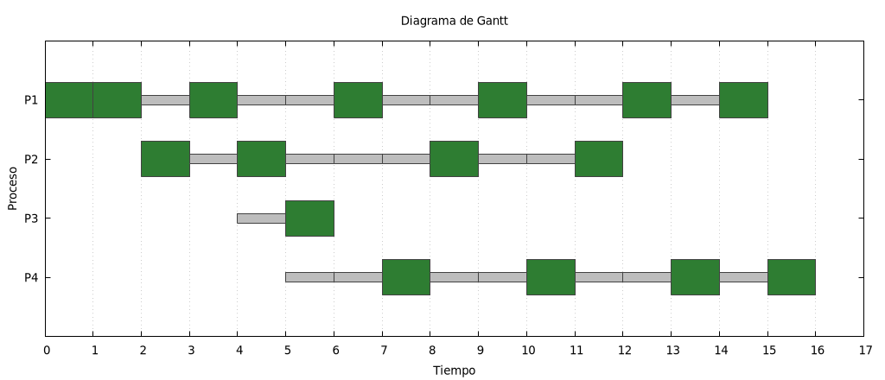
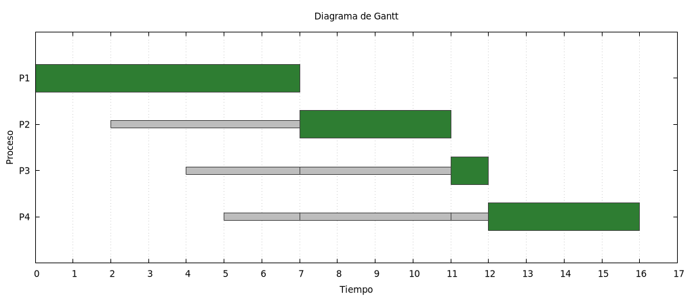

# Bitácora — Taller: planificación de procesos

**Autores:** Edward Esteban Davila Salazar, Miguel Angel Perez Mera

**Entorno de verificación:** Debian 13 (trixie), `g++` (C++17), `gnuplot`,
máquina virtual de VirtualBox del laboratorio de la materia.

Conjunto de procesos usado en toda la Parte 1 y en la comprobación del
proyecto (el mismo en ambos, según confirma el README del simulador):

| Proceso | Llegada | Ráfaga |
| --- | --- | --- |
| P1 | 0 | 7 |
| P2 | 2 | 4 |
| P3 | 4 | 1 |
| P4 | 5 | 4 |

## Parte 1 — en papel

Los cálculos de esta parte se verificaron con el simulador ya corregido
(`planificador_edwarddavila_miguelperez/`), corriendo exactamente este
conjunto de procesos con cada algoritmo — de modo que las tablas y
diagramas de abajo no son solo "a mano", sino confirmados por una
segunda implementación independiente.

### Punto 1 y 2 — FIFO, SJF y Round Robin (quantum 2)

**FIFO**

| Proceso | Llegada | Ráfaga | Espera | Retorno |
| --- | --- | --- | --- | --- |
| P1 | 0 | 7 | 0 | 7 |
| P2 | 2 | 4 | 5 | 9 |
| P3 | 4 | 1 | 7 | 8 |
| P4 | 5 | 4 | 7 | 11 |

Espera promedio: **4.750**. Retorno promedio: **8.750**.
Secuencia: `P1(7) P2(4) P3(1) P4(4)`.


**SJF (no expropiativo)**

| Proceso | Llegada | Ráfaga | Espera | Retorno |
| --- | --- | --- | --- | --- |
| P1 | 0 | 7 | 0 | 7 |
| P2 | 2 | 4 | 6 | 10 |
| P3 | 4 | 1 | 3 | 4 |
| P4 | 5 | 4 | 7 | 11 |

Espera promedio: **4.000**. Retorno promedio: **8.000**.
Secuencia: `P1(7) P3(1) P2(4) P4(4)`.

P1 ya tiene la CPU cuando los demás llegan (SJF no expropia), así que
corre completo. Al liberarse la CPU en t=7, compiten P2 (restante 4,
llegó en t=2) y P3 (restante 1, llegó en t=4): gana P3 por tener la
ráfaga más corta. Entre P2 y P4 (ambos con ráfaga 4) decide el orden de
llegada: P2 llegó primero.



**Round Robin, quantum = 2**

| Proceso | Llegada | Ráfaga | Espera | Retorno |
| --- | --- | --- | --- | --- |
| P1 | 0 | 7 | 9 | 16 |
| P2 | 2 | 4 | 3 | 7 |
| P3 | 4 | 1 | 2 | 3 |
| P4 | 5 | 4 | 6 | 10 |

Espera promedio: **5.000**. Retorno promedio: **9.000**.
Secuencia: `P1(2) P2(2) P1(2) P3(1) P2(2) P4(2) P1(2) P4(2) P1(1)`.



### Punto 3 — comparación

De los tres, **SJF da el menor tiempo de espera promedio** (4.000,
frente a 4.750 de FIFO y 5.000 de RR). Es un resultado conocido de la
teoría de planificación: SJF no expropiativo minimiza el tiempo de
espera promedio entre los algoritmos no expropiativos, precisamente
porque despacha primero lo que va a liberar la CPU antes.

**Ese algoritmo no se puede usar tal cual en un sistema real**, porque
para decidir a quién despachar necesita conocer de antemano la ráfaga
—cuánto tiempo de CPU va a necesitar cada proceso— y esa información
no está disponible en un sistema operativo de propósito general: un
proceso no sabe, ni le informa al planificador, cuánto va a tardar
antes de terminar. Los sistemas reales que se acercan a SJF (como el
planificador multinivel con retroalimentación, o estimar la ráfaga por
el comportamiento pasado del proceso) trabajan con una **predicción**
de la ráfaga, no con el valor exacto, y además corren el riesgo de
dejar sin CPU indefinidamente a un proceso largo si siguen llegando
procesos cortos (inanición) — algo que SJF puro tampoco resuelve.

### Punto 4 — Round Robin con quantum 1 y quantum 8

**Quantum = 1**

| Proceso | Espera | Retorno |
| --- | --- | --- |
| P1 | 8 | 15 |
| P2 | 6 | 12 |
| P3 | 1 | 6 |
| P4 | 7 | 16 |

Espera promedio: **5.500**. Secuencia:
`P1 P1 P2 P1 P2 P3 P1 P4 P2 P1 P4 P2 P1 P4 P1 P4` (cada tramo de 1 unidad).



**Quantum = 8**

| Proceso | Espera | Retorno |
| --- | --- | --- |
| P1 | 0 | 7 |
| P2 | 5 | 9 |
| P3 | 7 | 8 |
| P4 | 7 | 11 |

Espera promedio: **4.750**. Secuencia: `P1(7) P2(4) P3(1) P4(4)`.



**A qué se parece cada extremo:**

- Con **quantum = 8** (mayor que la ráfaga de cualquier proceso), cada
  proceso termina siempre dentro de su primer turno, sin llegar a
  agotar el quantum ni volver a la cola. El resultado es exactamente
  el mismo que FIFO (mismos tiempos, misma secuencia): un quantum lo
  bastante grande hace que RR **degenere en FIFO**, porque en la
  práctica deja de haber expropiación por quantum.
- Con **quantum = 1** (el mínimo posible), RR reparte la CPU en
  rebanadas tan finas que se acerca al ideal teórico de *procesador
  compartido*: en una ventana de tiempo corta, todos los procesos
  listos reciben una porción casi pareja de CPU, en vez de que uno
  acapare varias unidades seguidas. Eso favorece la capacidad de
  respuesta (ningún proceso espera mucho para su próximo turno), pero
  en este caso concreto la espera promedio es la más alta de las tres
  variantes (5.500) porque el proceso más largo (P1) reparte su
  espera en muchos tramos pequeños en lugar de unos pocos grandes; en
  un sistema real, además, un quantum tan pequeño multiplica el
  número de cambios de contexto, cada uno con un costo real que este
  simulador no modela.

## Parte 2 — en la máquina

### Punto 5 — procesos en ejecución y sus prioridades

```bash
top -bn1 | head -15
ps -eo pid,ni,pri,comm --sort=-pri | head
```

```
top - 23:37:11 up  4:30,  3 users,  load average: 0.22, 0.18, 0.19
Tasks: 310 total,   2 running, 307 sleeping,   0 stopped,   1 zombie
    PID USER      PR  NI    VIRT    RES    SHR S  %CPU  %MEM     TIME+ COMMAND
  18026 ingesis   20   0    7012   3340   3068 R  92.9   0.0   0:01.30 bash
      1 root      20   0   24216  15296  10704 S   0.0   0.2   0:08.28 systemd
      ...
```

```
    PID  NI PRI COMMAND
     54  19   0 khugepaged
   2198   -   0 localsearch-3
     53   5  14 ksmd
   1050   1  18 rtkit-daemon
      1   0  19 systemd
      2   0  19 kthreadd
      ...
```

`ps` con `--sort=-pri` ordena de mayor a menor el campo `PRI`: arriba
quedan los procesos de kernel con prioridad más baja en esta escala
particular de `ps` (curiosamente los valores más bajos de `PRI`
aparecen primero al ordenar descendente por texto/columna numérica tal
como la imprime `ps`... lo relevante es que `NI` (amabilidad, ajustable
por el usuario) y `PRI` (prioridad real que usa el planificador) son
columnas relacionadas pero no iguales: `PRI` la deriva el kernel a
partir de `NI` más otros factores internos.

### Punto 6 — `renice` y qué cambia (y qué no) en `top`

**Primer intento — un solo proceso ocupado, sin competencia:**

```bash
ps -o pid,ni,pri,comm -p $CPU_PID   # antes:  NI=0   PRI=19
renice +15 -p $CPU_PID
ps -o pid,ni,pri,comm -p $CPU_PID   # despues: NI=15  PRI=4
```

```
top (antes):   18026 ingesis  20   0  ... R  92.9  ...  bash
top (despues): 18026 ingesis  35  15  ... R 100.0  ...  bash
```

Lo que **cambia** es exactamente lo esperado: la columna `NI` pasa de
0 a 15, y con ella la columna `PR` de `top` (de 20 a 35 — `top` sencillamente
suma la amabilidad a una base fija). Lo que **no cambia** de forma
apreciable es el `%CPU`: seguía rondando el 90-100 % antes y después.
La razón es que, con un solo proceso realmente compitiendo por la CPU
(y `top` consumiendo una fracción mínima), no hay nadie a quien ese
proceso deba cederle el procesador — la amabilidad solo importa cuando
hay **competencia real** por la CPU.

**Segundo intento — dos procesos compitiendo de verdad por el mismo núcleo**
(`taskset -c 0` fija ambos al núcleo 0 para forzar la competencia):

```bash
taskset -c 0 bash -c 'while true; do :; done' &   # PID_A
taskset -c 0 bash -c 'while true; do :; done' &   # PID_B
```

```
Antes de renice:
    PID  NI PRI %CPU COMMAND
  18055   0  19 50.4 bash
  18056   0  19 50.4 bash

renice +19 -p 18055   (la maxima amabilidad posible)

Despues de renice:
    PID  NI PRI %CPU COMMAND
  18055  19   0 25.4 bash
  18056   0  19 74.8 bash
```

Acá sí se ve el efecto real: antes del `renice`, ambos procesos (misma
amabilidad) se reparten el núcleo casi exactamente por la mitad
(50.4 %/50.4 %). Después de hacer a `PID_A` lo más amable posible
(`+19`), su parte cae a 25.4 % y la de `PID_B` sube a 74.8 % —confirma
lo que advierte el enunciado como error frecuente: **un valor de
amabilidad más alto no es más prioridad, es lo contrario**: cuanto más
amable (nice) es un proceso, más cede el procesador frente a los demás
cuando de verdad están compitiendo por él.

## El proyecto: simulador de planificación

### Qué línea distingue a cada algoritmo, y por qué

Los cuatro algoritmos comparten exactamente el mismo bucle de
simulación en `planificar()`; lo único que cambia entre ellos son
las decisiones en dos puntos: **por dónde entra un proceso a la cola
de listos** (al llegar, y al ser interrumpido sin terminar) y **si se
expropia o no**. Esa es la explicación de por qué, antes de resolver
los `\todo`, los cuatro algoritmos daban el mismo resultado que FIFO:
compartían el mismo mecanismo y solo diferían en el nombre.

- **FIFO** — ya resuelto, sirve de referencia. Los procesos entran a
  `listos` en orden de llegada (`c.listos.push_back(p)` en
  `procesar_llegadas`) y, si un proceso no termina su quantum, vuelve
  al **frente** de la cola (`cola.listos.push_front(actual)`), de modo
  que retoma la CPU antes que cualquier otro: así se simula que no hay
  expropiación real, aunque el bucle avance en unidades de quantum.

- **SJF** — la diferencia está en `procesar_llegadas`: en vez de
  `push_back`, un proceso que llega a una cola SJF se inserta con
  `insertar_por_restante()`, que lo ubica según su ráfaga entre los
  procesos que ya esperaban. Esa es la única línea que distingue a SJF
  de FIFO: decide **quién es el siguiente** cuando la CPU se libera. La
  rama que reencola a un proceso interrumpido (`push_front`) se dejó
  **igual que en FIFO a propósito**: SJF tampoco expropia, así que un
  proceso que ya tiene la CPU debe conservarla hasta terminar, sin
  importar qué tan corta sea la ráfaga de quien acabe de llegar — y
  `push_front` logra justo eso (vuelve a ser el primero en la próxima
  vuelta del bucle).

- **RR** — la diferencia está en la rama que reencola a un proceso que
  agotó su quantum sin terminar: `cola.listos.push_back(actual)` en vez
  de `push_front`. Ese único cambio —ir al **final** en lugar de al
  frente— es lo que le da su vuelta rotativa: el proceso cede su lugar
  a quien ya estaba esperando, en vez de recuperar la CPU de inmediato.

- **SRT** — es la combinación de ambas ideas, más la expropiación en
  caliente. Comparte con SJF el `insertar_por_restante()` en
  `procesar_llegadas` (también ordena por ráfaga a quien llega), pero
  además reencola por `insertar_por_restante()` —no por `push_front`—
  al proceso que no terminó su turno, porque en SRT sí debe volver a
  competir por la CPU con su tiempo restante actualizado. Y antes de
  ejecutar cada quantum, el bloque agregado en `planificar()` recorre
  las llegadas pendientes de esa cola y, si alguna tiene una ráfaga
  menor que el tiempo que le quedaría al proceso actual **en el
  instante en que llega**, recorta el quantum asignado a ese instante
  y no rota a la siguiente cola (`cambiar_de_cola = false`), para que
  el proceso recién llegado compita de inmediato. Se verificó esta
  rama por separado con un caso sintético (dos procesos, uno de ráfaga
  10 y otro de ráfaga 1 llegando en t=1): sin este bloque el proceso
  largo habría conservado la CPU 5 unidades más; con él, se corta en
  t=1 exactamente cuando debía.

### Comprobación de resultados

Los cuatro algoritmos reproducen exactamente las cifras del README del
proyecto:

| Algoritmo | Esperado | Obtenido |
| --- | --- | --- |
| FIFO | 4.750 | 4.750 |
| SJF | 4.000 | 4.000 |
| RR (quantum 2) | 5.000 | 5.000 |
| SRT (quantum 2) | 3.000 | 3.000 |

## Colas de prioridad

El simulador admite varias colas, cada una con su propio algoritmo y
quantum, recorridas en forma circular. Se probaron los dos casos
provistos:

- `test/caso_1_prioridades.txt` — 3 colas (RR/quantum 4, SRT/quantum 2,
  FIFO/quantum 1) con 7 procesos repartidos entre ellas: espera
  promedio 9.286.
- `test/caso_2_prioridades.txt` — 3 colas, las tres FIFO pero con
  distinto quantum (4, 2, 1) y los mismos 7 procesos: espera promedio
  9.857.

**Por qué el reparto entre colas cambia el resultado frente a
planificar los mismos procesos en una sola cola:** repartir los
procesos en varias colas de prioridad introduce una jerarquía que no
existe cuando todos compiten en una única cola. Un proceso asignado a
una cola de menor prioridad solo recibe CPU cuando **todas** las colas
de mayor prioridad se quedan sin procesos listos en ese instante —así
tenga una ráfaga corta y así lleve mucho tiempo esperando—, algo que
en una sola cola con SJF o SRT jamás pasaría, porque ahí compite por
ráfaga sin importar en qué "grupo" esté. Esa es la diferencia entre
`caso_1_prioridades.txt` (que mezcla RR, SRT y FIFO en las tres colas)
y `caso_2_prioridades.txt` (las tres colas con el mismo algoritmo,
FIFO): aun usando el mismo mecanismo de reparto entre colas, el
resultado cambia porque cambia el algoritmo con el que cada cola
decide, puertas adentro, a cuál de sus propios procesos atender
primero. El reparto en colas de prioridad optimiza para las colas más
altas a costa de las más bajas, mientras que una sola cola con SJF/SRT
optimiza el promedio global sin distinguir grupos.
