# Bitácora — Taller: procesos, scripts y llamadas al sistema

**Autores:** Edward Esteban Davila Salazar, Miguel Angel Perez Mera

**Entorno de verificación:** Debian 13 (trixie), `gcc 14.2.0`, `bash`,
máquina virtual de VirtualBox del laboratorio de la materia. Usuario de
trabajo: `DVLASZ` (login institucional, con permisos de administrador
vía el grupo `sudo`), tal como pide la preparación del taller.

Esta bitácora sigue el orden del enunciado, punto por punto, con una
captura de cada avance (no solo las que el enunciado exige) tomada desde
la sesión de `DVLASZ`.

## Documentación consultada

```
man 5 proc      -> formato de /proc/PID/status y del resto de /proc
man 2 open      -> open(2)
man 2 read      -> read(2)
man 2 close     -> close(2)
man 2 getpid    -> getpid(2), getppid(2)
man 1 bash      -> operadores de subcadena y de patrones (${var#patron}, ${var%patron})
man 1 stat      -> stat(1)
man 1 wc        -> wc(1)
man 1 ps        -> ps(1)
```

## Preparación — usuario propio dentro de la VM

### Puntos 1-2: crear el usuario y comprobar que quedó registrado

```bash
sudo adduser DVLASZ
sudo adduser DVLASZ sudo
grep DVLASZ /etc/passwd
groups DVLASZ
```

`grep DVLASZ /etc/passwd` confirma el registro de la cuenta:
`DVLASZ:x:1001:1001:Edward Esteban Davila Salazar,,,:/home/DVLASZ:/bin/bash`
— identificador de usuario **1001**, directorio de inicio
**/home/DVLASZ**, intérprete **/bin/bash**.

`groups DVLASZ` confirma la pertenencia a grupos: `DVLASZ sudo users
vboxsf` — el grupo `sudo` es el que habilita las tareas administrativas
que hacen falta más adelante (parte 5).

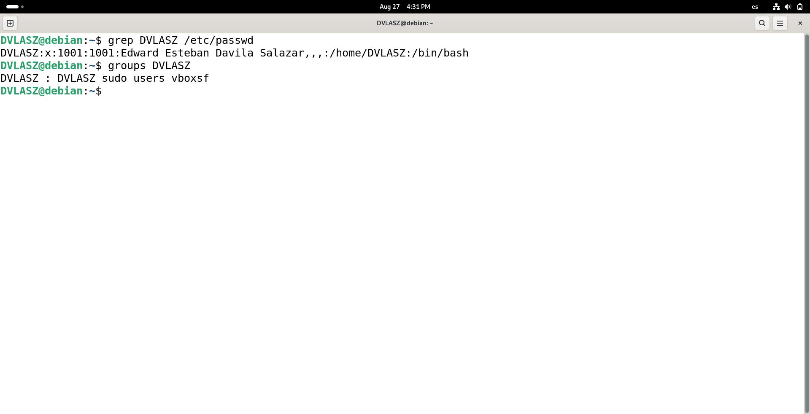

## Parte 1 — Observación desde el shell

### Punto 4: listar los procesos y localizar las columnas

```bash
ps -ef
ps aux
```

En `ps -ef` las columnas relevantes son `PID` (identificador del
proceso), `PPID` (identificador de su padre) y `CMD` (línea de
comandos completa). En `ps aux` la información equivalente aparece como
`PID` y `COMMAND`, y se agrega `STAT`, el estado del proceso (`S` =
durmiendo, `R` = en ejecución, `I` = inactivo/ocioso, entre otros).

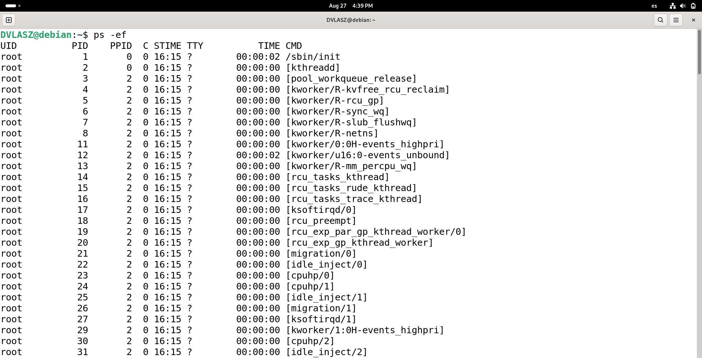

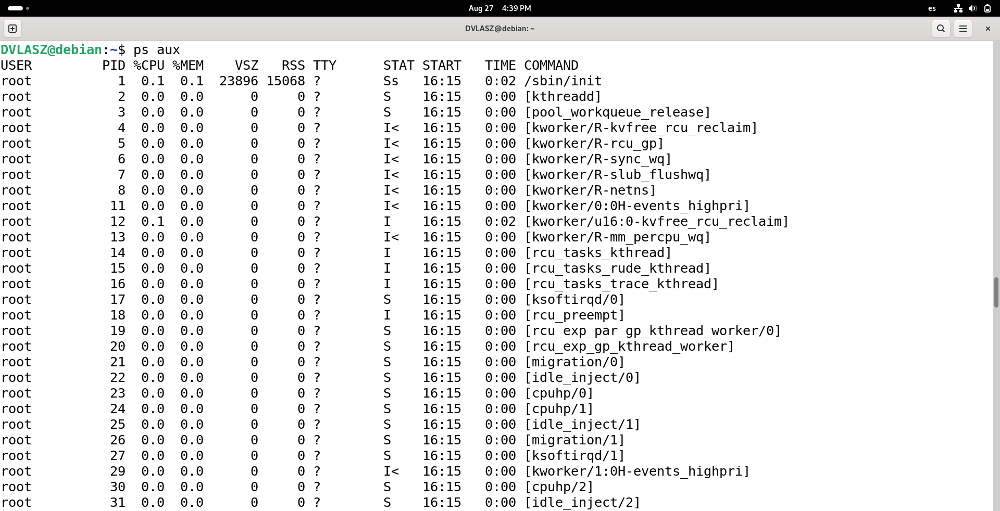

### Punto 5: lanzar un proceso propio en segundo plano y localizarlo

```bash
sleep 300 &
ps -ef | grep sleep
```

El shell informó `[1] 3761` al lanzar el job, y `ps -ef | grep sleep`
muestra el proceso `sleep 300` con **PID 3761** — coincide exactamente
con el que reportó el shell. El PPID (2911) corresponde a la propia
sesión de `bash`. Este mismo proceso (PID 3761) se dejó corriendo para
usarlo en los puntos 6 y 7.

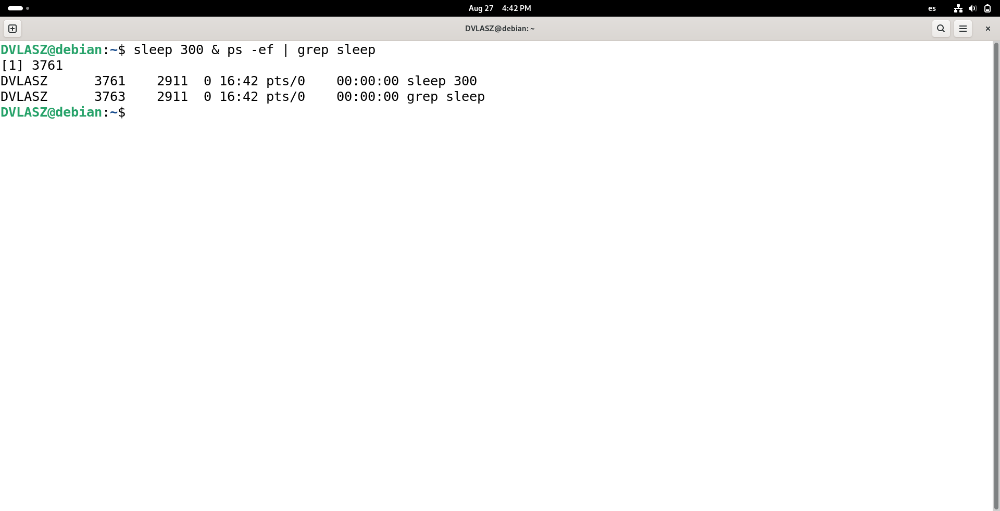

### Punto 6: estado del proceso en `/proc` y comparación `stat` vs `wc`

```bash
cat /proc/3761/status
```

Los campos coinciden exactamente con lo que ya había mostrado `ps`:
`Name: sleep`, `State: S (sleeping)`, `PPid: 2911` (la sesión de
`bash`). El campo `Threads` vale 1.

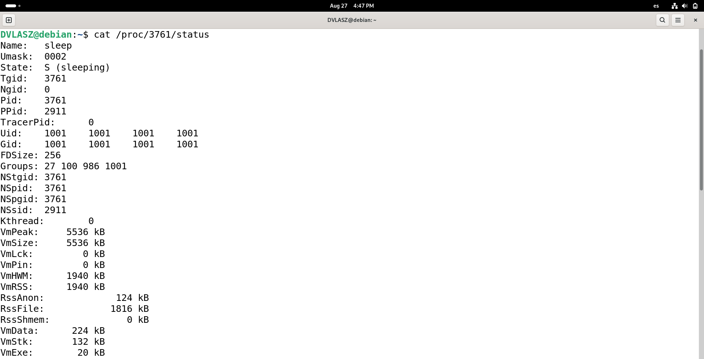

Al pedir el tamaño de ese mismo archivo de las dos formas que indica el
enunciado, pasó algo que vale la pena dejar anotado: entre el `stat` y
el `wc`, ya habían transcurrido los 300 segundos reales desde que se
lanzó el `sleep`, así que el proceso terminó solo justo en el medio del
experimento — `wc` encontró que el archivo ya no existía:

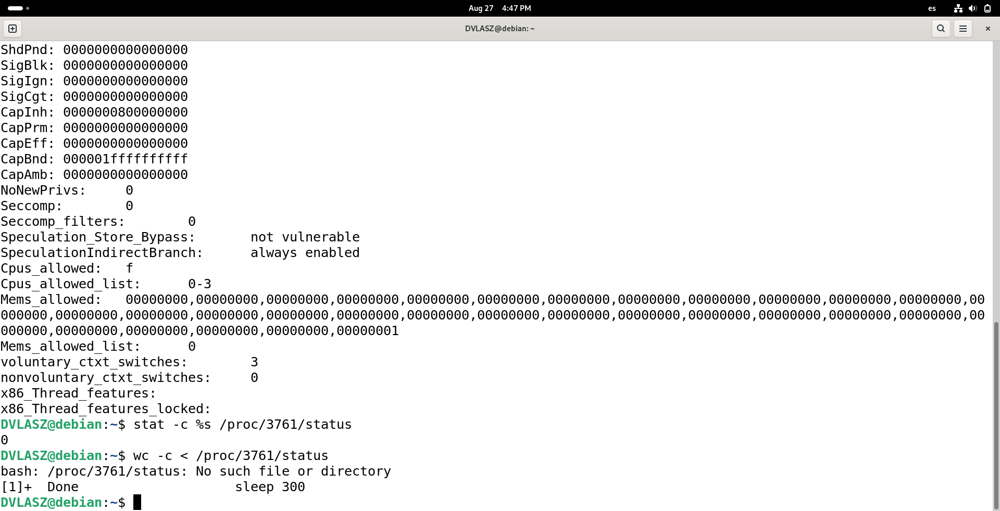

Esto no invalida el experimento — de hecho adelanta la explicación del
punto 7: el subdirectorio de `/proc` de un proceso deja de existir en
cuanto el proceso termina, sea por `kill` o, como en este caso, porque
terminó por su cuenta. Para tener la comparación de tamaños limpia (sin
que el archivo desaparezca a mitad de camino), se repitió sobre
`/proc/self/status` —el propio shell que ejecuta el comando, que no
puede terminar solo mientras se lo está usando— tal como lo muestra el
propio enunciado, y de paso se dejó un `sleep 300` nuevo (PID **4197**)
para el punto 7:

```bash
stat -c %s /proc/self/status
wc -c < /proc/self/status
sleep 300 &
```

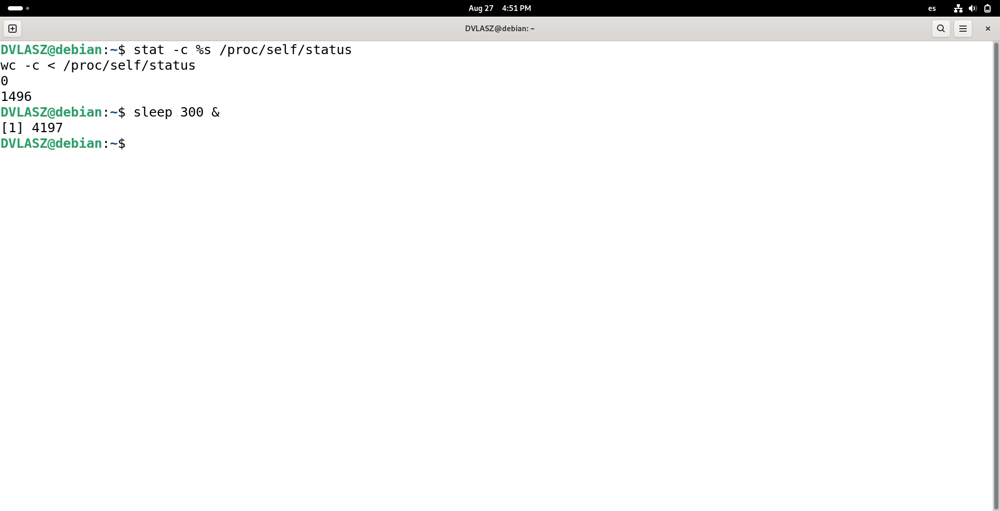

Las dos órdenes preguntan cosas distintas. `stat` no lee el archivo:
consulta los **atributos** que el sistema de archivos guarda sobre él,
entre ellos el tamaño registrado en el inodo. Los archivos de `/proc`
no tienen contenido real en disco — son una interfaz: el kernel genera
el texto en el momento en que alguien los lee, a partir del estado
actual del proceso. Como no existe un contenido almacenado de antemano,
tampoco existe un tamaño que registrar, y el atributo que `stat`
reporta es 0: no es una aproximación ni un error, es la ausencia real
del dato.

`wc -c`, en cambio, sí abre y lee el archivo completo, byte a byte, y
cuenta lo que efectivamente llega. Como la lectura sí dispara la
generación del contenido por parte del kernel, `wc` cuenta el tamaño
real del texto que se generó en ese instante (1496 bytes en esta
corrida). Esta es exactamente la razón por la que `infoproc.c` no puede
dimensionar su buffer a partir de `stat`: ese dato no existe para
archivos de `/proc`.

### Punto 7: terminar el proceso y comprobar que desaparece de `/proc`

```bash
sleep 300 &
PID_SEGUNDO_PLANO=$!
echo "PID lanzado: $PID_SEGUNDO_PLANO"
kill $PID_SEGUNDO_PLANO
ls /proc/$PID_SEGUNDO_PLANO
```

Se usó `$!` (el PID del último proceso lanzado en segundo plano) para
no tener que copiar el número a mano. Resultado: el `sleep 300` lanzado
con PID **4411** se mata con `kill`, y el `ls` inmediatamente posterior
confirma `No such file or directory` — el subdirectorio
`/proc/4411` dejó de existir apenas terminó el proceso. Es la misma
conclusión que ya había adelantado, por accidente, el punto 6: `/proc`
solo expone procesos vivos.

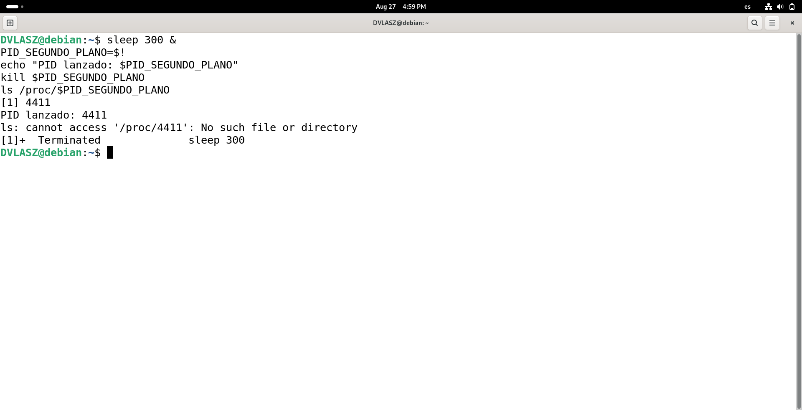

### Punto 8: cadena de procesos padre hasta el proceso 1

```bash
pid=$$
while true; do
    echo "--- PID $pid ---"
    grep -E 'Name|PPid' /proc/$pid/status
    [ "$pid" = "1" ] && break
    pid=$(grep PPid /proc/$pid/status | awk '{print $2}')
done
```

Cadena obtenida, partiendo del propio shell (`$$`):

```
PID 2911 -> bash          (PPid 2904)
PID 2904 -> gnome-terminal- (PPid 1591)
PID 1591 -> systemd        (PPid 1)
PID 1    -> systemd        (PPid 0)
```

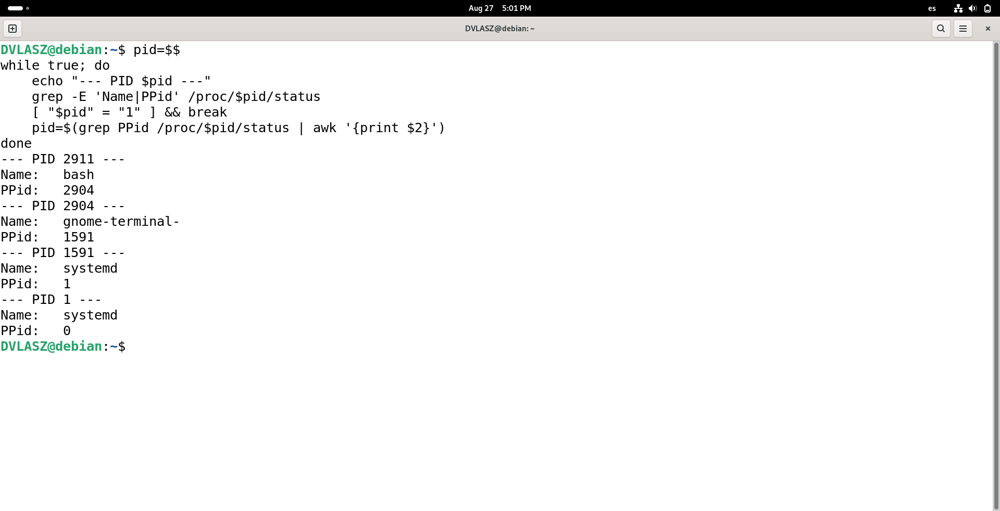

A diferencia de la cadena vista por SSH en pruebas anteriores (que pasaba
por `sshd`), acá el camino es el de una **sesión gráfica**: la terminal
(`bash`) fue lanzada por `gnome-terminal-` (el servidor de la aplicación
Terminal de GNOME), y ese proceso a su vez cuelga de un `systemd` con
PID 1591 — que llama la atención por tener el mismo nombre que el
proceso 1, pero es una instancia **distinta**: es el `systemd --user`,
la instancia de `systemd` que gestiona los servicios de la sesión de
usuario de `DVLASZ` (no los del sistema completo), y que a su vez fue
lanzada por el `systemd` de PID 1, el que sí arrancó con el kernel al
iniciar la máquina. El **proceso 1** es ese `systemd` de sistema: el
primer proceso que crea el kernel al arrancar, con `PPid: 0` — no tiene
padre porque no existe `/proc/0`, y ahí es donde el recorrido se
detiene.

## Parte 2 — el informe escrito como script de shell (`infoproc.sh`)

### Punto 12: formato crudo de una línea de `/proc/status`

```bash
cd ~/"Lab. Sistemas Operativos/Taller_Procesos_Y_Scripts"
ls -la infoproc.sh
grep Threads /proc/self/status
```

`ls -la` confirma el permiso de ejecución del script. `grep Threads`
muestra el formato real de cada línea: la etiqueta, un tabulador, y el
valor (`Threads:\t1`) — ese es el formato que `infoproc.sh` recorta con
operadores de patrones del shell (`${linea#Threads:}` y el recorte de
espacio en blanco inicial), sin invocar `grep` para la extracción en sí
(acá se usa solo para mostrar cómo luce la línea cruda).

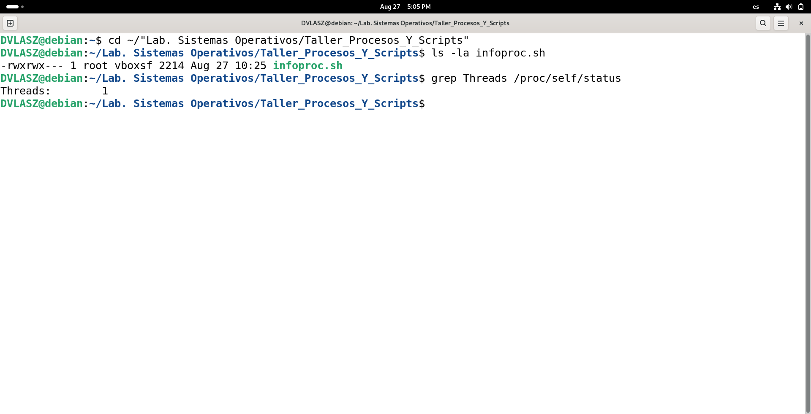

### Puntos 9, 10, 11, 13 y 14: correr `infoproc.sh` en sus tres escenarios

```bash
./infoproc.sh
echo "codigo de salida: $?"
./infoproc.sh $$
echo "codigo de salida: $?"
./infoproc.sh 999999
echo "codigo de salida: $?"
```

- **Sin argumento** (punto 9): informa sobre sí mismo (`$$`, PID 5133) y
  recorre toda la cadena hasta `systemd` (PID 1) — código de salida
  **0** (punto 14).
- **Con un PID puntual** (`$$` del shell, 2911): mismo comportamiento,
  cadena completa, código **0**.
- **Con un PID inexistente** (999999) (punto 10): termina de inmediato
  con `infoproc.sh: no existe ningun proceso vivo con pid 999999` y
  código de salida **1**, sin haber intentado leer nada de `/proc`
  (la comprobación `[ ! -d "/proc/$pid" ]` se hace antes que cualquier
  otra cosa).

De paso se confirma el punto 11 (`Name`, `State`, `PPid`, `Threads` del
proceso consultado) y el 13 (la cadena completa hasta el proceso 1, con
un renglón por proceso).

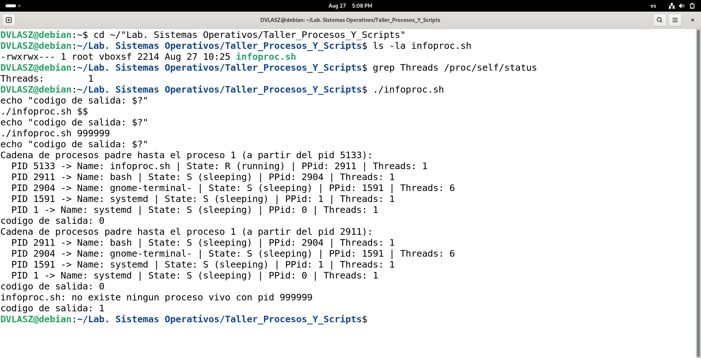

## Parte 3 — el mismo informe con llamadas al sistema (`infoproc.c`)

### Puntos 15-20: compilar con `make` y correr los mismos tres escenarios

```bash
make
./infoproc
echo "codigo de salida: $?"
./infoproc $$
echo "codigo de salida: $?"
./infoproc 999999
echo "codigo de salida: $?"
```

`make` compiló sin ninguna advertencia (`gcc -Wall -c -o infoproc.o
infoproc.c` seguido de `gcc -o infoproc infoproc.o`, punto 20).

- **Sin argumento**: `PID 5346 -> Name: infoproc | State: R (running) |
  PPid: 2911 | Threads: 1`, más `Propio proceso: pid=5346, ppid=2911`
  (punto 19, obtenido con `getpid`/`getppid`). Código de salida **0**.
- **Con el PID del shell** (2911): `Name: bash`, mismo formato. Código
  **0**.
- **Con un PID inexistente** (999999): `open()` falla, se informa con
  `perror` (`open: No such file or directory`, puntos 16 y 18) y el
  programa termina con código **1**, sin haber intentado leer nada más.

El resultado es idéntico en estructura al de `infoproc.sh`, salvo que
acá la lectura del archivo se hizo exclusivamente con `open`/`read`/
`close` (punto 16) en lugar de con el builtin `read` del shell.

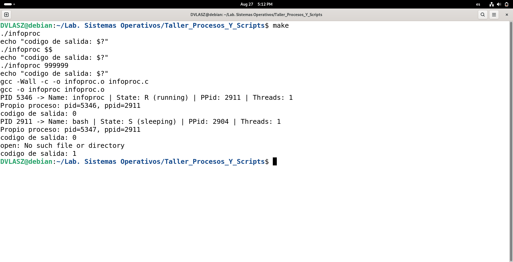

## Parte 4 — la comparación

### Punto 21: correr el script y el programa sobre el mismo PID

```bash
sleep 300 &
PID_PRUEBA=$!
echo "PID de prueba: $PID_PRUEBA"
./infoproc.sh $PID_PRUEBA
./infoproc $PID_PRUEBA
kill $PID_PRUEBA
```

Sobre el PID de prueba (5547), la primera línea de `infoproc.sh` y la
salida de `infoproc` son **idénticas**:

```
PID 5547 -> Name: sleep | State: S (sleeping) | PPid: 2911 | Threads: 1
```

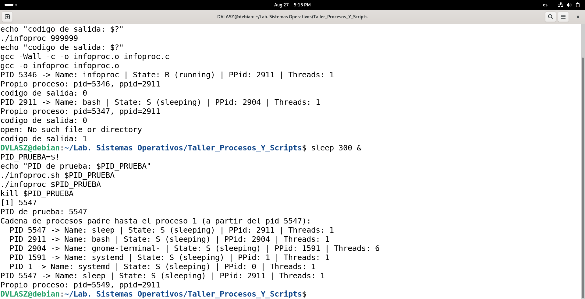

### Punto 22: por qué coinciden

Tienen que coincidir porque los dos programas son clientes distintos de
la **misma fuente de datos**: el kernel. Ninguno de los dos mantiene su
propia copia del estado de un proceso ni lo calcula por su cuenta —
ambos abren el mismo archivo virtual, `/proc/PID/status`, y el kernel
les entrega el mismo texto generado en ese instante, sin importar si
quien preguntó fue un script de shell leyendo con el builtin `read` o un
programa en C leyendo con `open`/`read`/`close`. La diferencia entre los
dos programas está únicamente en **cómo piden y procesan** ese texto
(operadores de patrones del shell vs. llamadas al sistema y funciones de
`string.h`), no en **qué** piden: el contenido de origen es idéntico,
así que el resultado final también lo es.

### Punto 23: el mismo experimento sobre un proceso que cambia de estado

```bash
pgrep -x firefox-esr | head -1
FF_PID=5857
./infoproc.sh $FF_PID | sed -n 2p; ./infoproc $FF_PID
```

Se abrió Firefox y se navegó normalmente (búsquedas, cambio de pestañas)
mientras se repetía esa última línea varias veces seguidas, apuntando
siempre al mismo PID (5857):

```
Threads: 113   (1ra corrida)
Threads: 113   (2da corrida)
Threads: 129   (3ra corrida)
Threads: 127   (4ta corrida)
```

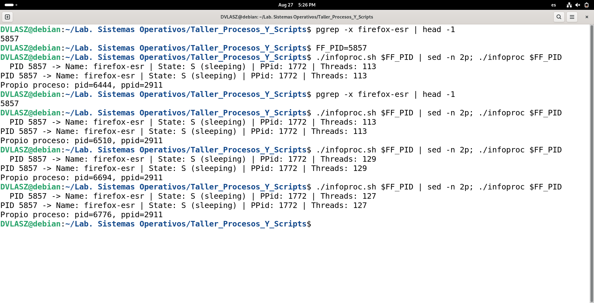

El `State` se mantuvo en `S (sleeping)` en las cuatro muestras —tuvo
sentido, porque Firefox pasa la enorme mayoría del tiempo esperando
eventos (red, interfaz gráfica), así que es lo más probable de
"atrapar" en una lectura puntual—, pero el campo **`Threads` sí cambió
de verdad** entre una corrida y otra (113 → 113 → 129 → 127): Firefox
crea y destruye hilos todo el tiempo mientras uno navega (por cada
pestaña, por tareas en segundo plano, etc.).

Dentro de cada corrida individual, `infoproc.sh` e `infoproc` siguen
coincidiendo entre sí (se ejecutan con una diferencia de tiempo
despreciable), pero **entre una corrida y la siguiente** el número de
hilos cambió porque el proceso observado realmente cambió entre una
lectura y otra. Esto confirma lo mismo que ya había insinuado el punto
6: `/proc` no es una fotografía fija ni un registro histórico, sino el
estado real en el instante exacto en que el kernel atiende esa lectura.
Dos programas que leen con una diferencia de tiempo suficiente pueden
legítimamente reportar cosas distintas sobre el mismo proceso — no
porque alguno se equivoque, sino porque el proceso mismo cambió entre
una lectura y la otra.

### Punto 24: qué hace el shell entre el comando y el prompt

Cuando se escribe una línea y se presiona Enter, el shell (`bash`) hace
todo esto antes de que exista un proceso nuevo, apoyándose en servicios
del sistema operativo:

1. **Lee y analiza la línea**: la separa en palabras, identifica el
   comando, sus argumentos, y cualquier redirección (`<`, `>`, `>>`) o
   tubería (`|`). Esto es puro procesamiento de texto, todavía no
   involucra al sistema operativo.
2. **Decide de dónde sale el comando**: si es una orden interna de
   `bash` (como `cd` o `export`), la ejecuta ella misma sin crear ningún
   proceso. Si es un ejecutable externo (como `ps` o `./infoproc`), lo
   busca recorriendo los directorios de la variable `PATH`.
3. **Pide al kernel un proceso nuevo con `fork()`**: esta llamada al
   sistema crea una copia casi idéntica del propio shell (mismo código,
   mismas variables, mismos descriptores de archivo abiertos). A partir
   de ahí hay dos procesos ejecutando el mismo programa: el shell
   original (padre) y la copia (hijo).
4. **El proceso hijo configura sus flujos y reemplaza su código con
   `execve()`**: antes de ejecutar el programa pedido, si la línea traía
   redirecciones o tuberías, el hijo ajusta sus descriptores de entrada,
   salida y error (por ejemplo con `dup2`) para que apunten a los
   archivos o a la tubería correspondientes. Recién entonces llama a
   `execve()`, que reemplaza por completo el código del proceso hijo por
   el del programa pedido (`ps`, `infoproc`, etc.), conservando el mismo
   PID.
5. **El shell padre espera con `wait()`/`waitpid()`**: mientras el hijo
   corre, el shell padre queda bloqueado esperando a que termine (salvo
   que la línea terminara en `&`, caso en el que no espera y el proceso
   queda en segundo plano, como se hizo en los puntos 5 y 7). El sistema
   operativo se encarga de despertarlo cuando el hijo termina.
6. **Recoge el código de salida y vuelve a mostrar el prompt**: el shell
   lee el estado de terminación que le entrega `wait()`, lo deja
   disponible en `$?` (usado en casi todas las capturas de esta
   bitácora), y vuelve a leer la entrada estándar, mostrando de nuevo el
   símbolo de espera.

En resumen: el shell en sí mismo no "ejecuta" el programa pedido — pide
al sistema operativo que le cree un proceso nuevo (`fork`), que ese
proceso cargue el programa (`execve`), y luego se queda esperando a que
el sistema operativo le avise que terminó (`wait`). Todo lo que
distingue a un comando de otro (variables de entorno heredadas,
descriptores redirigidos, el propio PID) ya quedó decidido por el shell
*antes* de pedirle al kernel que arranque el programa.

## Parte 5 — tarea de administración: conversión de video por lotes

### Punto 25: instalar ffmpeg y comprobar que responde

```bash
sudo apt install ffmpeg
ffmpeg -version
```

`ffmpeg` ya estaba instalado a nivel de sistema (se había instalado
antes para las pruebas de `convertir.sh`); `apt` lo confirma
("already the newest version") y `ffmpeg -version` responde con la
versión 7.1.5 y el detalle de codecs habilitados.

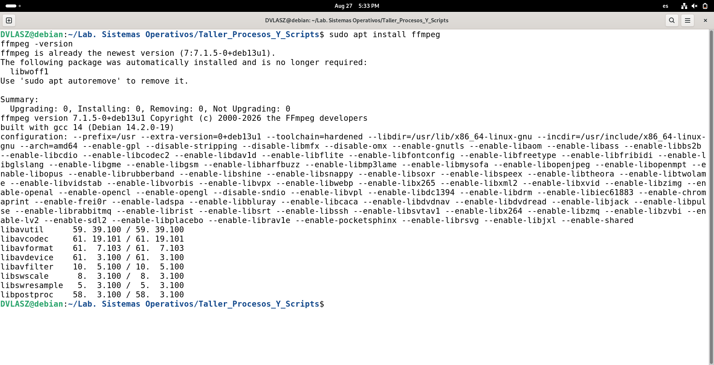

### Punto 26: generar los archivos de video de prueba

```bash
mkdir prueba_videos
cd prueba_videos
ffmpeg -f lavfi -i testsrc=duration=3:size=320x240 clase1.mkv
ffmpeg -f lavfi -i testsrc=duration=3:size=320x240 clase2.mkv
ffmpeg -f lavfi -i testsrc=duration=3:size=320x240 clase3.mkv
ffmpeg -f lavfi -i testsrc=duration=3:size=320x240 clase.2026.mkv
ls -la
```

Los 4 archivos (~17 KB cada uno, 3 segundos de video generado, no
descargado) quedan en una subcarpeta aparte (`prueba_videos/`) para no
mezclarlos con el código del taller — de cualquier forma el `.gitignore`
de la raíz del repo ya excluye `*.mkv`/`*.mp4`, así que no se suben aun
si quedaran sueltos. `clase.2026.mkv` es el nombre con varios puntos que
va a poner a prueba el recorte de extensión de `convertir.sh`.

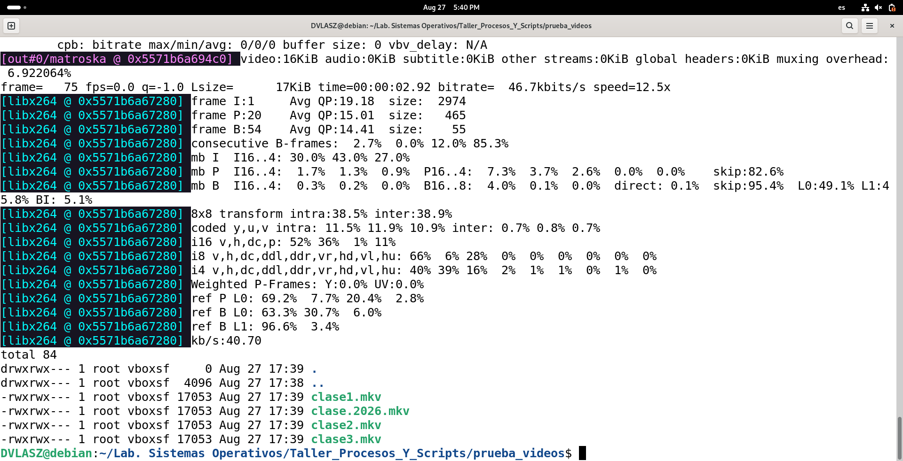

### Puntos 27-30: primera ejecución de `convertir.sh`

```bash
cd ~/"Lab. Sistemas Operativos/Taller_Procesos_Y_Scripts"
./convertir.sh prueba_videos
ls -la prueba_videos
```

Convirtió los 4 archivos, conservando el nombre —incluido
`clase.2026.mkv` → `clase.2026.mp4`, con el cambio de extensión resuelto
por el operador de patrones `${entrada%.mkv}.mp4` (punto 27)— e informó
`Convertidos: 4` / `Saltados: 0` (punto 30). El `ls -la` final confirma
los 8 archivos (4 `.mkv` + 4 `.mp4`) en la carpeta.

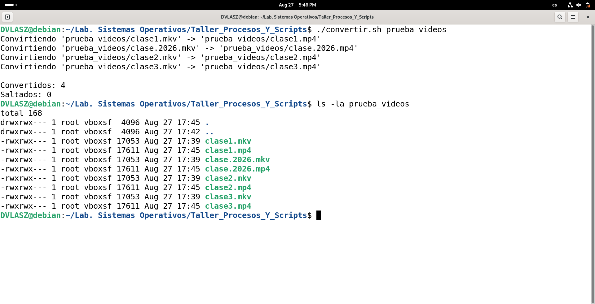

### Punto 31: segunda ejecución, debe ser silenciosa (sin convertir ni fallar)

```bash
./convertir.sh prueba_videos
echo "codigo de salida: $?"
```

La segunda corrida saltó los 4 archivos (`Convertidos: 0`, `Saltados:
4`) porque sus `.mp4` ya existían de la corrida anterior, informando
cada uno como pide el punto 28 — y terminó con código de salida **0**,
sin ningún error. Es "silenciosa" en el sentido que pide el enunciado:
no es un error forzado, es el flujo normal del script cuando no hay
nada nuevo que convertir.

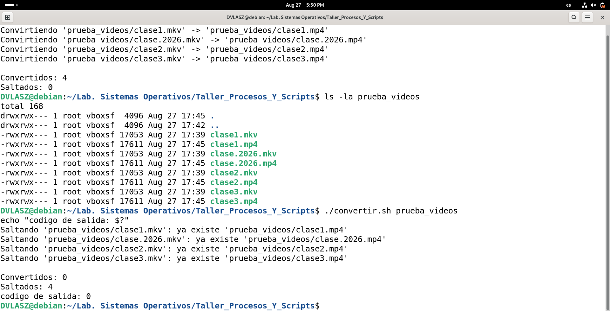

Con esta última, quedan cubiertas las 3 capturas que exige el punto 32
del enunciado (instalación de ffmpeg, primera y segunda ejecución de
`convertir.sh`), todas desde la sesión de `DVLASZ`.

